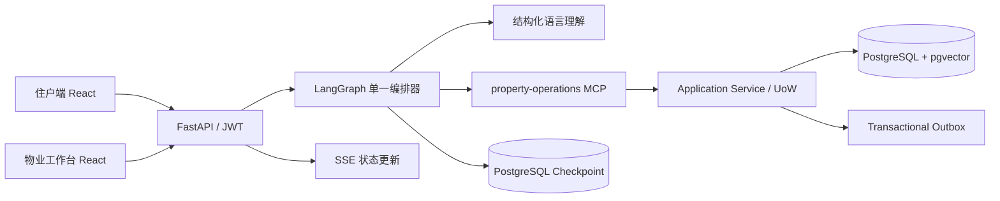

# FixFlow：智能物业维修协同 Agent

FixFlow 是一个面向住宅报修场景的可恢复、可审计 AI Agent。住户可以像聊天一样描述漏水、电气或门锁问题，系统负责理解需求、创建工单、推荐上门时间并同步处理进度；物业人员通过独立工作台接管异常任务和处理工单。

这个项目关注一个实际工程问题：**怎样把大模型的自然语言理解能力，安全地接入有权限、状态、并发和失败恢复要求的真实业务流程。**

> 当前定位：可本地运行和演示的工程项目。默认使用可复现的 `scripted` Provider；DeepSeek Flash 仅支持受控开发白名单，尚未作为生产模型启用。

## 项目亮点

- **自然语言报修**：支持多轮补充和更正，从口语中提取故障类型、房间位置与可上门时间。
- **确定性业务控制**：LLM 负责语言理解和受约束回复；权限、必填判断、工单流转、预约冲突和写库由确定性代码处理。
- **长流程可恢复**：使用 LangGraph Interrupt/Resume 与 PostgreSQL Checkpoint 保存进度，服务中断后可从数据库事实恢复。
- **可靠业务写入**：通过幂等键、乐观锁、数据库约束、事务 Outbox 和 `UNKNOWN_COMMIT` 对账处理重复提交、并发预约与响应丢失。
- **人工接管闭环**：物业工作台支持任务领取、释放、解决和关闭，并提供工单时间线、Trace 与恢复建议。
- **工程化验证**：包含单元测试、真实 PostgreSQL 集成测试、跨住户权限测试、并发测试和版本化模型评测。

## 产品流程

### 住户端

1. 注册并绑定已有房屋；
2. 用自然语言提交报修；
3. 补充必要信息并选择上门时间；
4. 查看工单与预约的最新状态；
5. 申请改期、转人工、确认修好或发起返工；
6. 归档、恢复或在满足条件时永久移除会话。

### 物业端

1. 按住址和处理状态查看工单；
2. 领取需要人工介入的任务；
3. 查看住户描述、业务状态、处理依据和执行记录；
4. 解决、释放或关闭人工任务；
5. 使用只读恢复控制台排查不确定提交和异常流程。

## 系统架构



核心边界：

- PostgreSQL 是业务事实源；
- Agent 不直接管理 ORM 事务；
- MCP 工具使用 Pydantic 契约传递结构化输入输出；
- 工单、预约和权限判断不由 LLM 决定；
- Replay 用于验证控制流，不重放业务写操作。

## 技术栈

| 层级 | 技术 |
| --- | --- |
| 前端 | React、TypeScript、Ant Design、Vite |
| API | Python 3.12、FastAPI、JWT、SSE |
| Agent | LangGraph、Pydantic、结构化输出、Interrupt/Resume |
| 工具层 | MCP Streamable HTTP、8 个类型化业务工具 |
| 数据层 | PostgreSQL、SQLAlchemy、Alembic、pgvector |
| 可靠性 | Idempotency Key、Optimistic Lock、Transactional Outbox、Replay、Trace |
| 工程化 | Docker Compose、uv、pytest、ruff、mypy |

## 关键工程设计

### 1. LLM 与业务规则分离

模型从用户表达中提取有证据的语言事实；安全等级、意图路由、缺失字段和预约合法性由确定性规则判断。这样既保留自然交互能力，也避免模型自行创建工单或预约。

### 2. 重试不产生重复工单

写操作要求 `Idempotency-Key`，数据库保存操作结果并校验请求指纹。即使客户端重试、MCP 响应丢失或服务暂时中断，也可以查询权威结果，而不是盲目重放 Mutation。

### 3. 防止预约并发冲突

候选时间按维修技能、服务区域、可用性和已有预约过滤；最终写入由 PostgreSQL 约束和事务保护，避免多个住户预约同一维修人员的重叠时间。

### 4. 长流程中断恢复

Agent State 严格 JSON 序列化，并通过独立的 PostgreSQL Checkpointer 持久化。恢复时重新读取最新业务快照，防止使用过期状态继续执行。

## 快速启动

### 环境要求

- Python 3.12
- [uv](https://docs.astral.sh/uv/)
- Docker 与 Docker Compose
- Node.js（Windows 建议使用仓库内的前端脚本）

### 1. 配置环境

```powershell
Copy-Item .env.example .env
```

编辑 `.env`，至少设置 PostgreSQL 密码和长度不少于 32 位的 `FIXFLOW_JWT_SECRET`。不要提交 `.env`。

### 2. 安装依赖并初始化

```powershell
uv sync
docker compose up -d postgres
uv run alembic upgrade head
$env:PYTHONPATH = "backend"
uv run python -m app.agent_runtime.initialize_checkpoints
uv run python -m app.dev_seed
```

### 3. 分别启动服务

```powershell
# MCP 服务
uv run python -m mcp_server

# API 服务
$env:PYTHONPATH = "backend"
uv run python -m app.api.run

# Outbox Dispatcher
uv run python -m app.outbox.run

# 前端
powershell -ExecutionPolicy Bypass -File scripts/operations/frontend.ps1 dev
```

打开 `http://127.0.0.1:5173`。演示账号由本地 Seed 创建，详见 `backend/app/dev_seed.py`；请勿在真实环境使用这些账号。

## 验证

```powershell
uv run pytest
uv run ruff check .
uv run ruff format --check .
uv run mypy
powershell -ExecutionPolicy Bypass -File scripts/operations/frontend.ps1 test
powershell -ExecutionPolicy Bypass -File scripts/operations/frontend.ps1 build
```

模型评测资产位于 `backend/evals`，覆盖自然语言理解、时间表达、多轮更正、安全边界和政策检索。评测默认可离线复现；真实在线调用必须显式允许网络并确认费用。

## 项目结构

```text
backend/app/
  agent/                 Agent State 与领域合并规则
  agent_runtime/         LangGraph 编排、节点与恢复逻辑
  api/                   FastAPI、鉴权、住户与物业接口
  application/           用例服务、事务与幂等
  infrastructure/        SQLAlchemy Repository 与数据库模型
  outbox/                事务 Outbox 和 Dispatcher
  property_operations/   MCP 业务契约
  replay/                确定性回放验证
  trace/                 持久化执行追踪
frontend/                住户端与物业工作台
mcp_server/              独立 MCP 服务进程
migrations/              Alembic 数据库迁移
docs/                    架构、状态机、接口和验收资料
```

## 深入阅读

- [架构设计](docs/ARCHITECTURE.md)
- [业务状态机](docs/STATE_MACHINE.md)
- [MCP 工具契约](docs/MCP_CONTRACTS.md)
- [Agent State](docs/AGENT_STATE.md)
- [消息可靠性与人工接管](docs/AGENT_RELIABILITY.md)
- [事务 Outbox](docs/OUTBOX.md)
- [Trace 与审计](docs/TRACE_RUNTIME.md)
- [Replay 设计](docs/REPLAY.md)
- [产品验收记录](docs/PRODUCT_ACCEPTANCE_20260909.md)
- [当前开发路线](docs/IMPLEMENTATION_ROADMAP.md)

## 当前限制

- 当前只覆盖漏水、电气和门锁三类维修；
- 默认 Provider 是可复现的 `scripted` 实现，在线模型尚未正式启用；
- SSE 事件总线目前面向单进程演示，多实例部署需要外部消息系统；
- 项目使用合成数据，尚未接入真实物业、住户或维修人员数据。

## License

本项目暂未选择开源许可证。公开仓库允许浏览代码，但不代表自动授予复制、修改或商业使用权。
