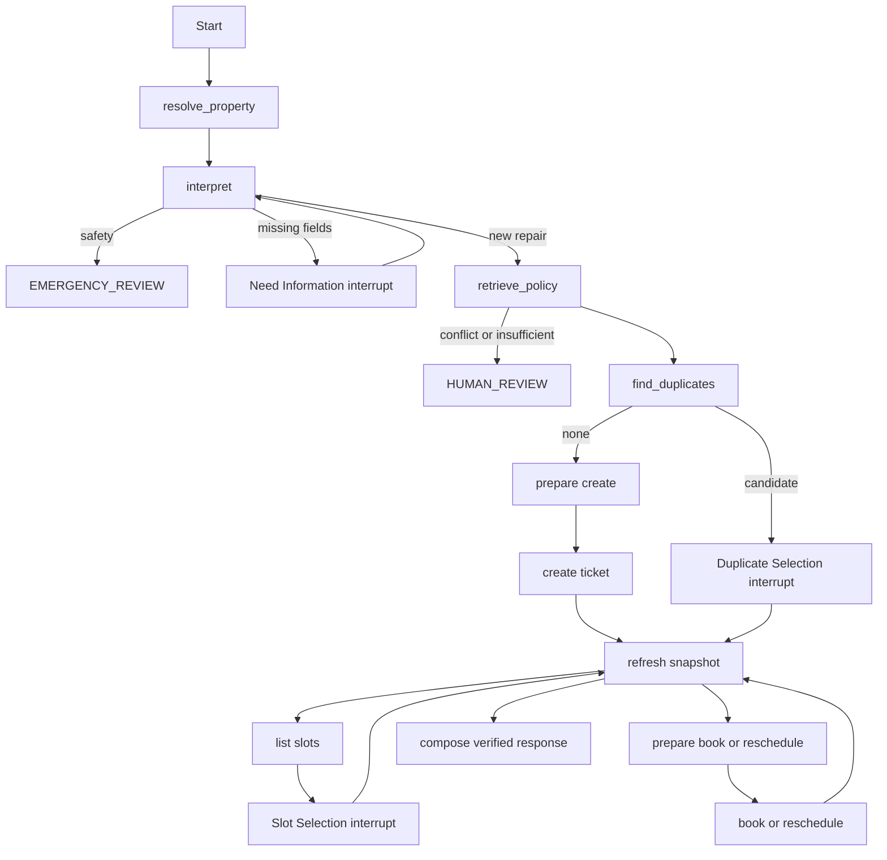

# Agent orchestration

## Scope and truth boundary

Task 8 adds one asynchronous LangGraph `StateGraph`. It coordinates the typed
Agent core, policy retrieval, and the independent property-operations MCP
server. PostgreSQL business tables remain the source of ticket and appointment
truth. A checkpoint contains bounded conversation work state only and is never
written back over a fresher business snapshot.

The default product runtime uses deterministic demonstration providers. Task 13
optionally replaces only the structured interpretation boundary with GLM-5.1;
compose and embedding remain deterministic. Task 11 adds UNKNOWN_COMMIT
reconciliation and test-only fault injection around this same orchestrator.
Task 12 adds tape-only deterministic Replay. Task 9 exposes the product through authenticated FastAPI
thread, message, state, strict Resume, and SSE endpoints.

JWT identity becomes the existing trusted caller context; request bodies cannot
override it. Each thread read, turn, resume, and SSE subscription still passes
the Task 8 ownership and current property-authority checks. API responses are
sanitised views and never expose checkpoint blobs, raw MCP results, or pending
operation hash material. The bounded in-memory SSE channel is notification-only
and does not change Graph recovery semantics.

Task 10 starts a persistent run before invoking the Graph, binds trusted
run/thread/trace correlation through async execution context, wraps each fixed
node with sanitized start/completion/failure events, and instruments MCP calls
with prepared/completed/failed summaries. Mutation MCP requests carry
server-generated run/thread/operation correlation to the Application UoW so
domain Outbox events can be projected back to the same run. These fields are
never accepted from the browser and do not enter canonical Agent State.

For the demo product path, policy queries append deterministic category and
requested-topic search context before retrieval. Ordinary resident phrasing can
therefore retrieve responsibility and appointment evidence without polluting
the persisted issue description or asking the language model to judge policy
sufficiency.

## Nodes and deterministic routing



Routers inspect typed intent, risk, policy sufficiency, current candidates, and
fresh snapshot facts. LLM output cannot name a node or tool. Policy text cannot
select a tool. Only approved mutation nodes call mutation methods.

Automated paths are `NEW_REPAIR`, `QUERY_TICKET_STATUS`, and
`RESCHEDULE_APPOINTMENT`. `REQUEST_HUMAN` verifies the thread owner and current
property authorization, stops automation, enters `HUMAN_REVIEW`, and replies
that property staff must handle the request. It does not call
`escalate_to_operator`, change a ticket, write `ticket.escalated`, or create an
escalation reconciliation Case. Cancellation and resident
acceptance/rejection intents are recognized but routed to `HUMAN_REVIEW`
because the eight-tool MCP contract does not yet expose those operations.

## Thread owner identity, property authorisation, and duration

A new thread requires trusted `actor_type`, `actor_id`, `user_id`, and
`property_id`. Only after `get_resident_property` succeeds are those values
frozen as one `ThreadOwnerIdentity`. A supplied property ID alone is never an
authorisation decision. Missing property context returns
`PROPERTY_CONTEXT_REQUIRED`; the chat is not asked to supply a UUID.

Every ordinary continuation compares its trusted actor/user tuple (and a
supplied property, if any) with that immutable owner identity, then calls
`get_resident_property` again **before** interpretation, policy retrieval, or a
business tool. `resume()` and `get_state()` require `AgentCallerContext` and
perform the same owner comparison; resume also reauthorises the property before
validating its Interrupt kind and fingerprint. A mismatch returns a sanitized
`THREAD_IDENTITY_CONFLICT` with no checkpoint state, interrupt, ticket, or
appointment content. A revoked relation stops safely and clears checkpoint-only
confirmation, selected-slot, and pending-operation data; it never deletes
PostgreSQL business facts. `trace_id` is per invocation only and is not part of
thread ownership or authorisation.

Natural-language property references remain unverified text. Model output
cannot write `property_id` or `property_context_verified`.

`SERVICE_DURATION_MINUTES_BY_CATEGORY` centrally maps all three first-release
categories to 60 minutes. User-stated estimates do not override this scheduling
rule. The MCP adapter receives it as `requested_duration_minutes`. Candidate
starts remain aligned to the Task 5 30-minute granularity.

## Interrupt, resume, and message replay

The three interrupt payloads are `NEED_INFORMATION`,
`DUPLICATE_TICKET_SELECTION`, and `APPOINTMENT_SLOT_SELECTION`. Resume inputs
are a closed discriminated union. They bind to `intent_version`, and selection
resumes also bind to the current candidate fingerprint. A stale version,
fingerprint, rank, ticket, wrong kind, missing interrupt, or different property
fails safely without advancing the Graph.

LangGraph config `thread_id` is always derived from the typed external input.
Switching actor, user, actor type, or property requires a new thread.
`get_state()` exposes a sanitized view only after trusted caller validation; it
never exposes checkpoint tuples, blobs, connections, or dependencies.

Every normal user turn has a deterministic message ID based on thread, trace,
and role, so node retry and process replay cannot append it twice. A structured
slot/duplicate-selection resume is control input, not a fabricated chat message.
A `PROVIDE_INFORMATION` resume is the sole exception: it contains a real new
user message, is appended once with its own message ID, and returns to typed
interpretation without changing the durable goal merely because information was
supplied.

## Snapshot refresh and idempotency

The Graph refreshes `get_ticket_snapshot` after ticket creation, before a
confirmed booking/reschedule, after mutations, for status queries, and before
ticket escalation. If the database version differs from the checkpoint version,
the database wins and stale slot confirmation is cleared.

Mutation preparation is a separate checkpointed node. Its stable key hashes:

```text
thread_id + intent_version + action + normalized payload
+ target entity + expected ticket/appointment versions
```

It excludes trace ID, current time, retry count, and random IDs. Replaying the
same logical operation therefore reaches Application idempotency with the same
key. A tool success whose response is lost is not advertised as success; a
the fenced reconciliation worker and a fresh PostgreSQL snapshot establish the
business result. Task 11 covers three Resident Agent mutations plus one
Operator-only escalation mutation. Task 12 can verify those recorded control
decisions without redispatching them.

## Checkpoint database and lifecycle

`CHECKPOINT_DATABASE_URL` points to a separate database such as
`fixflow_checkpoints` on the same PostgreSQL server. The official
`AsyncPostgresSaver.setup()` owns its internal schema. Business Alembic does not
create, inspect, or remove these tables. The composition root initializes the
saver once, compiles the Graph, shares one initialized MCP session, and closes
all resources at shutdown. Pickle fallback and dynamic serialization modules
are disabled; checkpoint state is a validated Agent State JSON string.

For a new developer environment, after Docker PostgreSQL is healthy run:

```powershell
$env:PYTHONPATH = "backend"
uv run python -m app.agent_runtime.initialize_checkpoints
```

The command reads `CHECKPOINT_DATABASE_URL`, creates only the named checkpoint
database if absent, and invokes the official saver setup. It never copies
LangGraph internal SQL into this repository. `.env.example` provides a safe
placeholder. This explicit command is not part of an ordinary Graph run.

On Windows, psycopg asynchronous connections require a Selector event loop.
`initialize_checkpoints` configures it before `asyncio.run`; every future Agent
host entrypoint must call the same narrowly scoped function before creating its
event loop. No library module changes the global policy at import time.

## Deterministic Replay

Task 12 reuses `build_agent_graph`; it does not define a second workflow.
The production execution context optionally carries a focused
`ReplayCapturePort`. Graph wrappers record node entry and router decisions,
while recording adapters capture validated interpretation, policy, MCP read,
and mutation-delivery results.

Verification restores only `ReplaySafeAgentState`, uses the Bundle reference
time, consumes existing-thread authorization from tape, and runs the same
topology with recorded dependencies and an in-memory saver. Resume is primed
inside that disposable saver before the recorded strict Resume union is
applied. Formal PostgreSQL Checkpoint tables and current domain state are not
read or written. See `docs/REPLAY.md`.
