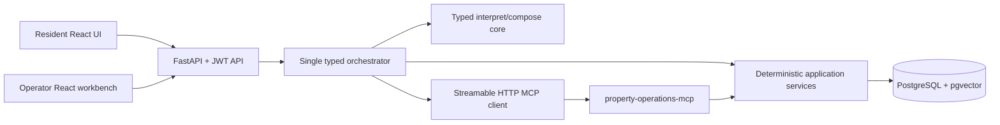

# Architecture

## System boundary



The API, orchestrator, and MCP handlers depend on application-service
interfaces. Application services own transactions and call domain/repository
ports. LLM and workflow code never opens ORM transactions.

The MCP server is a separate process. Online and fake MCP implementations must
use the same Pydantic request and result schemas.

## Current implementation status

Completed foundations now include project initialization, the approved domain
state design, pure domain transitions, SQLAlchemy persistence mappings, two
reviewable business migrations, focused Repository ports and SQLAlchemy
implementations, Unit of Work, deterministic application services, and real
PostgreSQL transaction/concurrency tests.

Task 5 adds a deterministic candidate-slot Application query and the independent
`property-operations-mcp` process with eight typed tools, Streamable HTTP, and
real MCP-client transport coverage.

Stage A, Task 6, and Task 7 are committed. Task 8 adds a single typed LangGraph,
strict Interrupt/Resume, an isolated PostgreSQL checkpointer, fresh business
snapshot recovery, stable mutation idempotency keys, and a production
Streamable HTTP MCP client. Task 7 adds versioned synthetic policy
documents, pgvector chunks, SQL-first effective/category/topic filtering,
deterministic hybrid retrieval, evidence conflicts, sufficiency, and frozen
retrieval evaluation. Embedding-space identity is persisted and must match
exactly before vector comparison; evidence IDs survive clean database rebuilds,
and stale retrieval results cannot merge into a newer intent. Task 6 adds the strict Agent State, deterministic
`intent_version` invalidation, provider-neutral LLM contract, versioned prompts,
and independently tested interpret/compose nodes. FastAPI business endpoints,
online LLM/embedding integration, Trace, Outbox, Harness, full system evaluation,
remain later roadmap stages. Task 9 adds the trusted JWT caller boundary,
sanitised Agent/Resident/Operator APIs, bounded development SSE, and the first
React resident and operator surfaces. It does not move business rules into
routers or the browser.

## Product API boundary

```text
React -> FastAPI router -> authenticated caller / API service
      -> AgentOrchestrator or Application query/service -> PostgreSQL
AgentOrchestrator -> Streamable HTTP MCP -> Application service -> PostgreSQL
```

JWT establishes actor identity only. Property access is reread from PostgreSQL,
and a token never grants a permanent property claim. Routers contain neither
SQLAlchemy queries nor MCP tool calls. The Task 9 SSE bus is bounded,
single-process, and non-replayable; it is not Trace or a business fact source
and is intentionally replaced or augmented in Stage C. Browser SSE uses Fetch
Streaming with a Bearer header. Mutation HTTP responses and the cleansed Thread
State endpoint are authoritative delivery paths; reconnect reconciles through
Thread State. Operator thread review is a separate read-only, ticket-linked and
sanitised projection, never a bypass around Resident ownership.

## Policy retrieval boundary

```text
Orchestrator -> PolicyRetrievalService -> Policy Repository -> PostgreSQL/pgvector
```

The policy Application layer owns strict requests, import idempotency, fusion,
conflict detection, sufficiency, and safe evidence models without importing
SQLAlchemy. Infrastructure performs one SQL-filtered candidate query and never
commits inside the Repository. A dedicated Policy Unit of Work owns atomic
document/chunk import. Policy text is untrusted evidence and has no access to
Agent State, tools, or business mutations. See `docs/POLICY_RAG.md`.

## Typed Agent core boundary

```text
Orchestrator -> Agent State / deterministic merge
Orchestrator -> interpret_message / compose_response -> LLMProvider
Orchestrator -> Streamable HTTP MCP Client -> property-operations-mcp
```

The two language nodes receive bounded typed inputs and return validated typed
results. They import no MCP, Application Service, Repository, Unit of Work, ORM,
or database session. Only deterministic merge code can update work state after
interpretation. The LLM cannot set domain status, authorize property access,
select mutation retry behavior, or claim a business write succeeded.

Agent State contains conversation work and cached aggregate versions, never the
authoritative ticket/appointment record. Established category,
normalized-location, or durable task-intent changes increment `intent_version`,
invalidate stale planning, preserve cached versions, and require a PostgreSQL
snapshot refresh. New safety evidence only marks safety review as required and
invalidates risk-dependent plans; a separate deterministic router may then set
`EMERGENCY_REVIEW`. Model output cannot set severity or workflow stage. See
`docs/AGENT_STATE.md` for the full matrix.

Task 8.1 keeps the graph as one fixed orchestration topology but moves node
implementations into responsibility modules (property, interpretation, policy,
tickets, scheduling, escalation, interrupts, and response). `graph.py` only
registers those fixed nodes and edges. Nodes receive a frozen, non-checkpointed
`NodeContext`, never an ORM session, repository, or application transaction.
Routers remain deterministic plain Python; this is not a dynamic node or tool
execution framework.

The checkpointed thread is owned by the immutable verified tuple
`actor_type + actor_id + user_id + property_id`. Every normal turn and every
resume rechecks owner identity and property authorisation before language or
business work. A trace ID is an invocation correlation value, not authority.

## Source-of-truth rules

- PostgreSQL owns users, properties, authorization relations, tickets,
  appointments, worker data, immutable worker events, versions, and history.
- `workflow_stage` is orchestration progress, not domain truth.
- A workflow resume must reread current ticket and appointment snapshots and
  compare versions before continuing.
- Candidate slots are transient workflow data until the resident confirms one;
  only then is a formal appointment created.
- Core entities use relational columns. JSONB is limited to trace payloads,
  structured model snapshots, tool request/results, fault configuration, and
  state-delta details.

Candidate starts use a centralized 30-minute natural-clock boundary. Eligibility
requires an active worker, the frozen issue-to-skill mapping, normalized exact
service-area equality, full availability coverage, and no overlapping `BOOKED`
appointment. In release 1, `properties.community_name` is the property service-area
identifier. Normalization is limited to trimming, case folding, and collapsing
spaces. Results sort by start time, open-ticket workload, and stable worker ID.
Every returned worker already passed the hard area constraint, so area is
explanatory metadata and not a ranking term.

## Implemented core persistence model

The user-approved state design is implemented in the pure domain layer and the
core PostgreSQL schema. Revision `20260719_0001` is the first business migration
and revision `20260719_0002` adds Task 4 audit links without rewriting it;
`docs/DATABASE_SCHEMA.md` records their exact tables and constraints.

| Aggregate/table | Key responsibilities and constraints |
| --- | --- |
| `users` | Preset resident/operator identities and active status |
| `properties` | Property identity, building/unit, and service area |
| `resident_property_relations` | Authorized resident-property relation with FKs and uniqueness |
| `repair_tickets` | Issue fields, approved ticket status, resident/property FKs, version, rework count, and current escalation prior status |
| `ticket_status_history` | Every accepted status change with actor and trace identifiers |
| `workers` | Active flag, service area, and stable identity |
| `worker_skills` | Worker-to-supported-issue-category relation |
| `worker_availability` | Time windows used by deterministic matching |
| `appointments` | Immutable time interval and `INITIAL_REPAIR`/`REWORK` purpose, approved status, ticket/worker FKs, version, required terminal-outcome actor/reason/evidence/timestamp data, and supersession link |
| `appointment_status_history` | Every accepted transition with actor, Trace, and version data |
| `worker_events` | Canonical append-only behavior linked to its appointment (and through it the ticket), subject worker, real recording actor, Trace, sequence, and source idempotency key |
| `idempotency_records` | Unique operation scope/key, request hash, result reference, and status |

Future-phase tables such as conversations, checkpoints, policies, Trace,
Outbox, dead letters, and any additional ticket event stream are documented in
the project specification and roadmap but are not created yet.

## Concurrency and transaction boundary

- Ticket and appointment mutations use optimistic versions.
- Active worker appointments use a PostgreSQL range exclusion constraint to
  prevent overlaps even under concurrent requests.
- A partial unique index allows at most one active `BOOKED` appointment per
  ticket. Appointment interval and worker fields are immutable after creation.
- Idempotency keys have a database unique constraint and are scoped to the
  business operation/actor as defined during week 1.
- A service commits the business mutation and history in one transaction.
- In phase 3, externally observed events also write an Outbox record in that
  transaction.

Repository ports are use-case focused rather than generic CRUD interfaces.
Application services acquire request idempotency, authorize the actor, reread
current snapshots, call pure domain rules, perform version-guarded writes, append
history, and persist the successful result inside one Unit of Work. SQLAlchemy
repositories explicitly map ORM rows to immutable domain snapshots. Named
database constraints are translated to stable application conflict codes.

The implemented storage strategy is a Python string Enum paired with a PostgreSQL
string column and named `CHECK` constraint, rather than PostgreSQL Native Enum.
The approved transition rules will live in the domain layer; API, MCP, workflow,
and ORM adapters never set statuses directly.

For generic appointment `CANCELLED`/`NO_SHOW`, the database and domain schema
retain `actor_type`, `actor_id`, `reason_code`, `reason_text`, `evidence`, and
`occurred_at`. Reason codes distinguish resident/worker no-show and resident,
worker, worker-rejection, operator, and system cancellation without expanding
the appointment-status enum. Terminal appointments never reactivate; later work
creates a new row and audit corrections are append-only.

## Known worker-event ordering limitation

Release 1 uses strict worker-event ordering to simplify audit and state
consistency. It cannot directly handle missing intermediate events. If offline
backfill is later required, add an explicit Operator reconciliation workflow
rather than weakening ordinary Worker Event validation.

## Error taxonomy

The application/MCP boundary separates:

- domain errors: illegal transition, invariant violation, overlap;
- application errors: permission denial, idempotency conflict, stale version;
- infrastructure errors: database/MCP/network unavailable or malformed response.

## Approved dependency direction

```text
API / MCP / future workflow
          -> application services
          -> domain model and repository protocols
          -> infrastructure adapters
```

Infrastructure imports domain/application contracts; domain code does not
import FastAPI, MCP, LangGraph, or SQLAlchemy sessions.

The MCP composition root creates one async engine and session factory per server
process, then wires Unit of Work, Application Service, a thin adapter, and tool
handlers. Each Application call receives its own Unit of Work. Handlers never
import ORM models or Repository implementations and the engine is disposed at
server shutdown. MCP currently trusts an upstream-authenticated actor identity;
the Application layer still rechecks database-backed business authorization.
JWT authentication belongs to Stage B.

## Established implementation decisions

- Repository root: `F:\agent\fixflow`.
- Python: exactly 3.12.
- Dependency management: uv, committed `uv.lock`, no parallel dependency files.
- PostgreSQL image line: pgvector-enabled PostgreSQL 16 for local development.
- The approved final enums and matrices are implemented in the pure domain layer
  and covered by domain tests.
- The core ORM and first business migration are implemented and verified through
  real PostgreSQL upgrade/downgrade and constraint tests.
