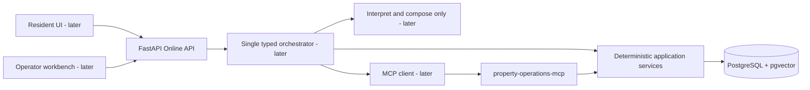

# Architecture

## System boundary



The API, future orchestrator, and MCP handlers depend on application-service
interfaces. Application services own transactions and call domain/repository
ports. LLM and workflow code never opens ORM transactions.

The MCP server is a separate process. Online and fake MCP implementations must
use the same Pydantic request and result schemas.

## Current implementation status

Completed foundations are project initialization, the approved domain-state
design, pure domain transitions, SQLAlchemy persistence mappings, the first
business Alembic migration, PostgreSQL constraint/integration tests, and the
implementation-roadmap alignment gates. The verified baseline at Task 3.5 is
215 passing tests.

The next implementation boundary is repositories, Unit of Work, and
deterministic application services. MCP, FastAPI business endpoints, LangGraph,
RAG, Trace, Outbox, Harness, evaluation, and frontend work remain later roadmap
stages.

## Source-of-truth rules

- PostgreSQL owns users, properties, authorization relations, tickets,
  appointments, worker data, immutable worker events, versions, and history.
- `workflow_stage` is orchestration progress, not domain truth.
- A workflow resume must reread current ticket and appointment snapshots and
  compare versions before continuing.
- Candidate slots are transient workflow data until the resident confirms one;
  only then is a formal appointment created.
- Core entities use relational columns. JSONB is limited to trace payloads,
  structured model snapshots, tool request/results, fault configuration, and
  state-delta details.

## Implemented core persistence model

The user-approved state design is implemented in the pure domain layer and the
core PostgreSQL schema. Revision `20260719_0001` is the first business migration;
`docs/DATABASE_SCHEMA.md` records its exact tables and constraints.

| Aggregate/table | Key responsibilities and constraints |
| --- | --- |
| `users` | Preset resident/operator identities and active status |
| `properties` | Property identity, building/unit, and service area |
| `resident_property_relations` | Authorized resident-property relation with FKs and uniqueness |
| `repair_tickets` | Issue fields, approved ticket status, resident/property FKs, version, rework count, and current escalation prior status |
| `ticket_status_history` | Every accepted status change with actor and trace identifiers |
| `workers` | Active flag, service area, and stable identity |
| `worker_skills` | Worker-to-supported-issue-category relation |
| `worker_availability` | Time windows used by deterministic matching |
| `appointments` | Immutable time interval and `INITIAL_REPAIR`/`REWORK` purpose, approved status, ticket/worker FKs, version, required terminal-outcome actor/reason/evidence/timestamp data, and supersession link |
| `appointment_status_history` | Every accepted transition with actor and version data |
| `worker_events` | Canonical append-only behavior linked to ticket/appointment, subject worker, real recording actor, sequence, and source idempotency key |
| `idempotency_records` | Unique operation scope/key, request hash, result reference, and status |

Future-phase tables such as conversations, checkpoints, policies, Trace,
Outbox, dead letters, and any additional ticket event stream are documented in
the project specification and roadmap but are not created yet.

## Concurrency and transaction boundary

- Ticket and appointment mutations use optimistic versions.
- Active worker appointments use a PostgreSQL range exclusion constraint to
  prevent overlaps even under concurrent requests.
- A partial unique index allows at most one active `BOOKED` appointment per
  ticket. Appointment interval and worker fields are immutable after creation.
- Idempotency keys have a database unique constraint and are scoped to the
  business operation/actor as defined during week 1.
- A service commits the business mutation and history in one transaction.
- In phase 3, externally observed events also write an Outbox record in that
  transaction.

The implemented storage strategy is a Python string Enum paired with a PostgreSQL
string column and named `CHECK` constraint, rather than PostgreSQL Native Enum.
The approved transition rules will live in the domain layer; API, MCP, workflow,
and ORM adapters never set statuses directly.

For generic appointment `CANCELLED`/`NO_SHOW`, the database and domain schema
retain `actor_type`, `actor_id`, `reason_code`, `reason_text`, `evidence`, and
`occurred_at`. Reason codes distinguish resident/worker no-show and resident,
worker, worker-rejection, operator, and system cancellation without expanding
the appointment-status enum. Terminal appointments never reactivate; later work
creates a new row and audit corrections are append-only.

## Known worker-event ordering limitation

Release 1 uses strict worker-event ordering to simplify audit and state
consistency. It cannot directly handle missing intermediate events. If offline
backfill is later required, add an explicit Operator reconciliation workflow
rather than weakening ordinary Worker Event validation.

## Error taxonomy

Future implementation separates:

- domain errors: illegal transition, invariant violation, overlap;
- application errors: permission denial, idempotency conflict, stale version;
- infrastructure errors: database/MCP/network unavailable or malformed response.

## Approved dependency direction

```text
API / MCP / future workflow
          -> application services
          -> domain model and repository protocols
          -> infrastructure adapters
```

Infrastructure imports domain/application contracts; domain code does not
import FastAPI, MCP, LangGraph, or SQLAlchemy sessions.

## Established implementation decisions

- Repository root: `F:\agent\fixflow`.
- Python: exactly 3.12.
- Dependency management: uv, committed `uv.lock`, no parallel dependency files.
- PostgreSQL image line: pgvector-enabled PostgreSQL 16 for local development.
- The approved final enums and matrices are implemented in the pure domain layer
  and covered by domain tests.
- The core ORM and first business migration are implemented and verified through
  real PostgreSQL upgrade/downgrade and constraint tests.
