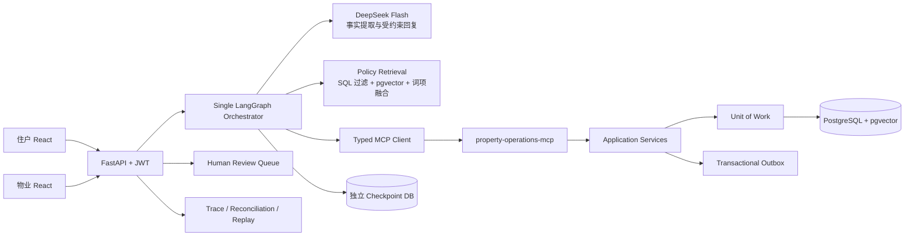

# FixFlow 架构讲解

## 一张图讲清主链路



## 30 秒架构说明

> 前端只调用 FastAPI。JWT 建立调用者身份，但房屋权限仍从 PostgreSQL 复核。Single Orchestrator 负责长流程编排，模型只返回严格 Schema 的语言事实；确定性代码计算意图、缺失字段、安全路由和状态转换。所有业务写操作通过 typed MCP 进入 Application Service 和 Unit of Work。PostgreSQL 是工单事实源，Checkpoint 不是。Outbox、Trace、UNKNOWN_COMMIT 对账和 Replay 分别处理消息交付、审计、不确定提交和控制面确定性验证。

## 为什么选择 Single Orchestrator

- 业务范围只有三类报修，控制流明确，不需要多个 Agent 竞争决策。
- 单一 Typed State 更容易保证身份、版本和恢复边界。
- 路由、权限和状态转换可由代码审计，不把关键业务交给模型协商。
- 多 Agent 会增加路由、共享记忆、成本和故障归因复杂度，当前收益不足。

如果未来出现独立的合规、复杂诊断或跨供应商采购域，可把它们建设成边界清晰的服务或专用 Agent，但不能共享不受控的写权限。

## 模型与确定性代码的分工

| 模型负责 | 确定性代码负责 |
| --- | --- |
| 从自然语言提取有证据的类别、位置、描述和可用时间 | 身份与房屋授权 |
| 识别请求人工、安全线索和语义修正 | 工单/预约状态机 |
| 在事实白名单内生成友好回复 | 缺失字段、风险路由、服务时长 |
| 失败时返回类型化错误 | 候选排序、预约冲突、事务和写库 |

模型不能输出 `ticket_status`、`appointment_status`、`workflow_stage`、业务 ID 或工具调用。即使输出了，也会在 Schema/合并边界被拒绝。

## 事务与并发

Application Service 不接触 HTTP，Router 不接触 ORM。SQLAlchemy Repository 不提交事务，Unit of Work 是唯一提交边界。

关键保证：

- 业务数据、状态历史和幂等成功结果同事务提交；
- 乐观锁使用 `UPDATE ... WHERE id AND version`；
- 同一工单最多一个 `BOOKED` 预约；
- 同一维修人员的 `BOOKED` 时间使用 GiST 排斥约束防重叠；
- Worker Event 在预约行锁内重读并分配序号；
- 相同幂等键不同 Payload 返回冲突，不静默复用结果。

## 为什么需要 MCP

MCP 在这里不是“让模型自由调用工具”。它是独立进程中的 typed business boundary：

```text
Graph Node -> Typed MCP Client -> property-operations-mcp
           -> Application Service -> UoW -> PostgreSQL
```

收益是 Agent 与业务服务解耦、契约可测试、传输可替换。代价是多一个进程和网络故障面，因此需要超时、错误映射、幂等和 UNKNOWN_COMMIT 对账。

## 四类可靠性能力不要混为一谈

| 能力 | 解决的问题 | 不做什么 |
| --- | --- | --- |
| Outbox | 业务提交后可靠交付领域事件 | 不恢复模型推理 |
| Trace | 记录清洗后的运行与调用证据 | 不是业务事实源 |
| Reconciliation | 判断不确定提交是否已经持久化 | 不盲目重发 Mutation |
| Replay | 用原 Run 的结构化 Tape 重跑控制逻辑 | 不访问真实 MCP、业务库或生产 Checkpoint |

## RAG 的工程边界

- 政策版本使用半开有效期 `[effective_from, effective_to)`；同一政策版本不可重叠。
- SQL 先过滤类别、主题、启用状态和有效期，再进行向量/词项检索与 RRF 融合。
- Embedding Profile 固化 provider、model、dimension 和 profile version，导入与查询必须一致。
- 充分性和冲突由确定性代码判断；政策正文作为不可信 Evidence，不能驱动工具。
- 当前 Corpus 是合成演示资产；正式小区政策必须经过合同、地区与责任边界审批。

## 恢复与事实源

LangGraph Checkpoint 保存流程状态，但每次恢复都重新读取工单和预约版本。原因是用户可能在 Agent 暂停期间通过物业渠道改变业务事实。Checkpoint 中的旧快照不能覆盖 PostgreSQL。

## 当前上线边界

本项目已达到稳定本地面试演示候选。生产化仍需要：正式模型资格、目标小区政策审批、TLS、监控告警、异地备份与恢复演练、操作员排班和发布回退授权。

